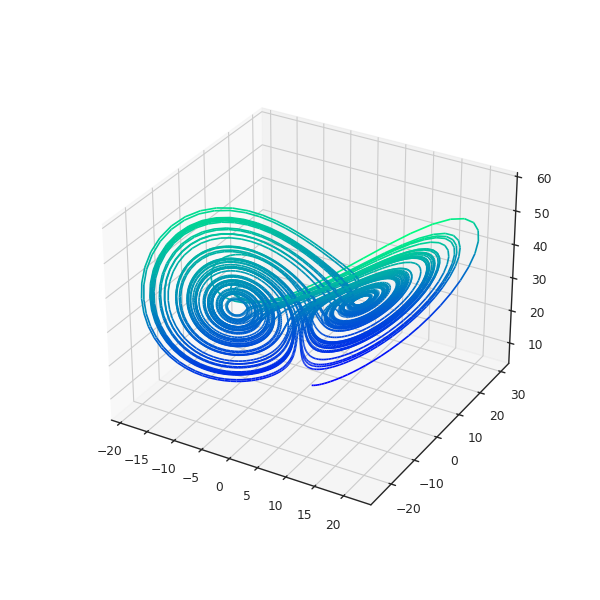
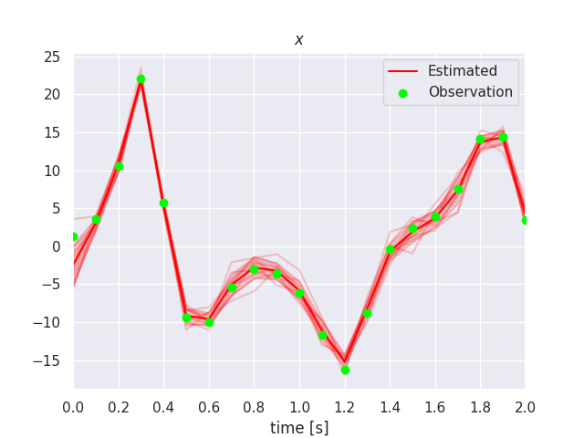
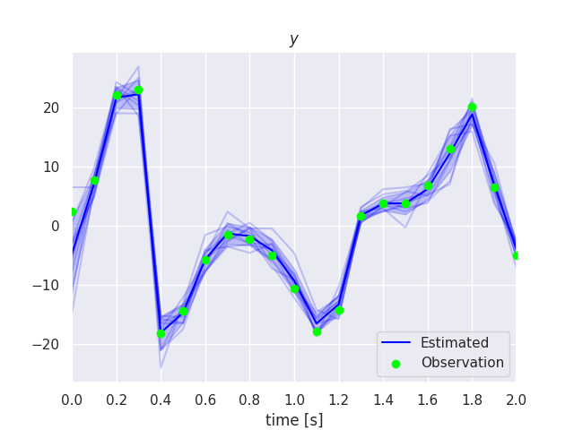
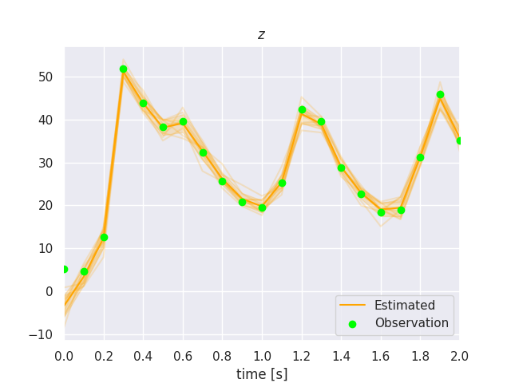

# Douka Plugin for Lorenz63

$$
\partial_t x = \sigma (y - x)
$$

$$
\partial_t y  = x (\rho - z) - y
$$

$$
\partial_t z = x y - \beta z
$$




## Requirements
- douka
  - https://github.com/MaterialsModellingLab/douka.git
- Python3 (for plotting the results)
  - All the required packages are listed in `requirements.txt`


## Build & Install
### Build Tools
- `CMake`
- `Ninja`
- C++ Compiler
  - `C++17`

### X86 or ARM platform
Type the following command at the project root directory to build and install the plugin.

```bash
cmake --preset release
cmake --build build/release
cmake --install build/release
```

### F64AX platform
```bash
cmake --preset a64fx-release
cmake --build build/a64fx-release
cmake --install build/a64fx-release
```

## Run data assimilation
### Generate Observation Data
```shell
./scripts/obsgen.sh
```

### Generate Initial System Vector Distribution
```shell
./scripts/init.sh
```


### Run Data Assimilation
```shell
./scripts/run.sh
```


### Showing Results
```shell
$  ./scripts/plot.py --help
usage: plot.py [-h] [--show]

plot the estimation result

options:
  -h, --help  show this help message and exit
  --show      show the plot
```




